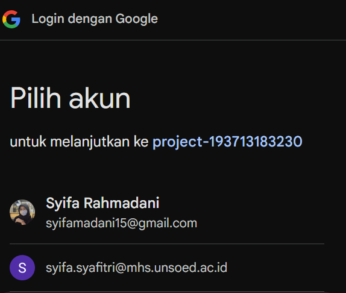
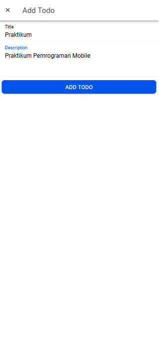
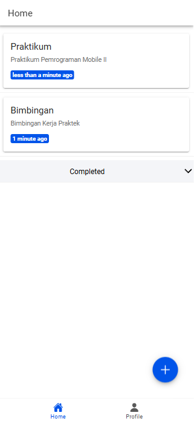
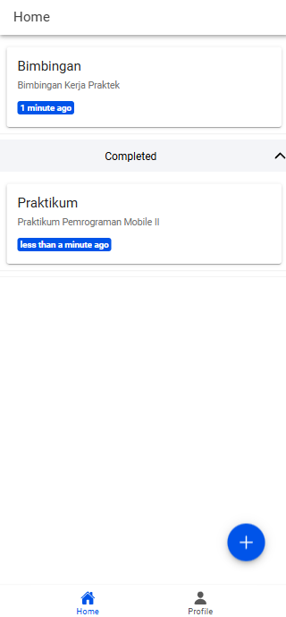
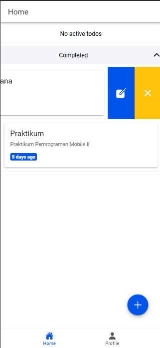
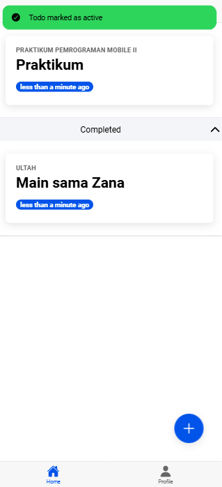

# Screenshoot dan Penjelasan

## Login 

Halaman login terdapat judul aplikasi dan tombol "Sign In with Google". Tombol tersebut menggunakan komponen ion-button dan ikon Google yang akan memicu proses autentikasi kalau diklik. Halaman merupakan landing page pertama ketika user ngakses aplikasi. Ketika user menekan tombol Sign In, popup pemilihan akun Google muncul. Ini merupakan interface bawaan dari Google OAuth yang memungkinkan user milih akun yang akan digunakan untuk login. Proses ini menggunakan @codetrix-studio/capacitor-google-auth untuk menangani autentikasi di platform mobile.

## Login Gagal 

Jika terjadi kesalahan saat proses login, aplikasi akan munculin alert yang memberitahu user bahwa login gagal dan meminta untuk mencoba kembali.

## Home Page

Setelah berhasil login, user diarahkan ke halaman Home. Halaman ini munculin header dengan judul "Home" dan tab menu di bagian bawah untuk navigasi. Router guard mastiin halaman ini cuma bisa diakses oleh user yang sudah terautentikasi.

## Profile Page

Halaman profile menampilkan informasi user yang didapat dari akun Google, termasuk:
- Foto profil (menggunakan komponen ion-avatar)
- Nama lengkap (diambil dari displayName)
- Email (diambil dari data akun Google) Ada juga tombol logout di pojok kanan atas untuk mengakhiri sesi.

# Alur Autentikasi dan Pengambilan Data Profile
1. **Inisialisasi Firebase dan Google Auth**  
Aplikasi memulai Firebase menggunakan konfigurasi dari file `firebase.ts`. Google Auth juga diaktifkan menggunakan client ID yang telah terdaftar. Sebuah store Pinia (`auth.ts`) disiapkan untuk mengelola status autentikasi.  

2. **Proses Login**  
Ketika pengguna mengklik tombol "Sign In with Google", metode `loginWithGoogle()` di store autentikasi akan dijalankan. Popup dari Capacitor Google Auth muncul untuk memilih akun. Setelah akun dipilih, Google mengirimkan token, yang kemudian digunakan untuk membuat kredensial Firebase. Data pengguna yang berhasil masuk disimpan di state Pinia.  

3. **Mengambil Data Profil**  
Setelah autentikasi berhasil, Firebase menghasilkan objek `User`. Informasi profil pengguna seperti nama, email, dan foto diambil dari objek tersebut dan disimpan di store Pinia, sehingga dapat diakses di seluruh aplikasi. Komponen seperti *Profile* menggunakan computed property untuk menampilkan data ini.  

4. **Melindungi Route**  
Sebelum berpindah halaman, *router guard* (beforeEach) akan memeriksa status autentikasi pengguna. Halaman yang memerlukan login, seperti home dan profil, hanya dapat diakses jika pengguna telah login. Sebaliknya, pengguna yang sudah login tidak diperbolehkan kembali ke halaman login.  

5. **Proses Logout**  
Ketika pengguna memilih untuk keluar, metode `logout()` dipanggil. Firebase dan Google Auth akan menjalankan proses *sign out*. Status pengguna di Pinia diatur ulang, dan pengguna diarahkan kembali ke halaman login.  # LabMobile10_Syifa_ShiftD

# Tugas 10 
## Todo

Fitur menambah todo memungkinkan pengguna untuk membuat task baru. Proses dimulai dari tampilan awal yang menampilkan daftar todo yang ada. Ketika tombol "+" ditekan, form add todo akan muncul dimana pengguna dapat memasukkan judul task baru. Setelah mengisi dan menekan tombol submit, todo baru akan ditambahkan ke dalam daftar dan langsung ditampilkan di halaman utama.

## Edit Todo

Untuk mengedit todo yang sudah ada, pengguna dapat menggeser ke kiri task todo yang telah dibuat sebelumnya lalu tekan tombol edit berwarna biru yang ikon pensil pada todo yang ingin diubah. Form edit akan muncul dengan data todo yang sudah ada, memungkinkan pengguna untuk mengubah judul task. Setelah perubahan disimpan, todo akan diperbarui dengan judul dan desc yang baru.

## Complete

Pengguna dapat menandai todo sebagai selesai dengan menggeser ke kiri lagi task todo yang telah dibuat sebelumnya lalu tekan tombol check berwarna hijau. Ketika ditandai selesai, tampilan todo akan berubah di posisi "completed" untuk menandakan bahwa task tersebut telah diselesaikan. Status todo akan disimpan sehingga tetap terlihat sebagai selesai meskipun aplikasi diakses lagi.

Todo yang sudah ditandai selesai dapat diaktifkan kembali dengan menggeser ke kiri task todo yang bagian completed lalu tekan tombol "x" berwarna kuning. Hal ini akan mengembalikan tampilan todo ke status aktif yang berada di atas dan menandakan bahwa task tersebut perlu dikerjakan lagi. Fitur ini fungisnya buat pengguna yang ngga sengaja menandai todo sebagai selesai.

##  Delete 

Untuk menghapus todo, pengguna dapat menggeser ke kanan task todo yang ingin dihapus hingga muncul seperti tampilan tombol hapus (ikon tempat sampah). Setelah konfirmasi, todo akan dihapus secara permanen dari list. Operasi ini ngga ada alert konfirmasinya sehingga tidak dapat dibatalkan, makanya pengguna harus berhati-hati saat menghapus todo. Setelah dihapus, todo tidak akan muncul lagi dalam daftar dan tidak dapat dikembalikan.