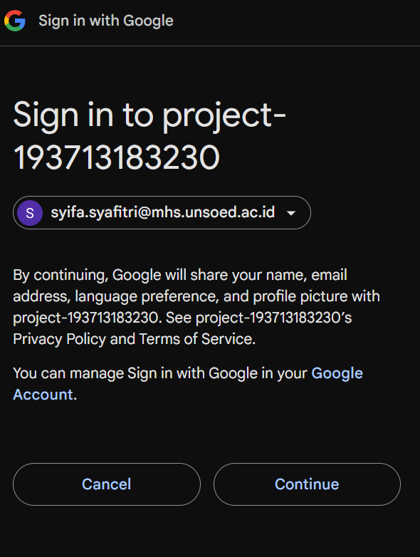
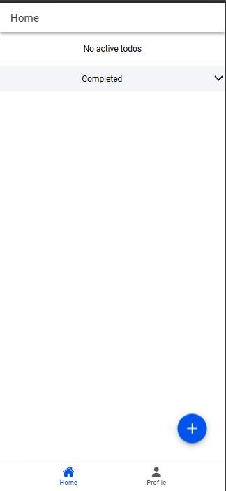

# Screenshoot dan Penjelasan

## Login 

Halaman login terdapat judul aplikasi dan tombol "Sign In with Google". Tombol tersebut menggunakan komponen ion-button dan ikon Google yang akan memicu proses autentikasi kalau diklik. Halaman merupakan landing page pertama ketika user ngakses aplikasi. Ketika user menekan tombol Sign In, popup pemilihan akun Google muncul. Ini merupakan interface bawaan dari Google OAuth yang memungkinkan user milih akun yang akan digunakan untuk login. Proses ini menggunakan @codetrix-studio/capacitor-google-auth untuk menangani autentikasi di platform mobile.

## Login Gagal 

Jika terjadi kesalahan saat proses login, aplikasi akan munculin alert yang memberitahu user bahwa login gagal dan meminta untuk mencoba kembali.

## Home Page

Setelah berhasil login, user diarahkan ke halaman Home. Halaman ini munculin header dengan judul "Home" dan tab menu di bagian bawah untuk navigasi. Router guard mastiin halaman ini cuma bisa diakses oleh user yang sudah terautentikasi.

## Profile Page

Halaman profile menampilkan informasi user yang didapat dari akun Google, termasuk:
- Foto profil (menggunakan komponen ion-avatar)
- Nama lengkap (diambil dari displayName)
- Email (diambil dari data akun Google) Ada juga tombol logout di pojok kanan atas untuk mengakhiri sesi.

# Alur Autentikasi dan Pengambilan Data Profile
1. **Inisialisasi Firebase dan Google Auth**  
Aplikasi memulai Firebase menggunakan konfigurasi dari file `firebase.ts`. Google Auth juga diaktifkan menggunakan client ID yang telah terdaftar. Sebuah store Pinia (`auth.ts`) disiapkan untuk mengelola status autentikasi.  

2. **Proses Login**  
Ketika pengguna mengklik tombol "Sign In with Google", metode `loginWithGoogle()` di store autentikasi akan dijalankan. Popup dari Capacitor Google Auth muncul untuk memilih akun. Setelah akun dipilih, Google mengirimkan token, yang kemudian digunakan untuk membuat kredensial Firebase. Data pengguna yang berhasil masuk disimpan di state Pinia.  

3. **Mengambil Data Profil**  
Setelah autentikasi berhasil, Firebase menghasilkan objek `User`. Informasi profil pengguna seperti nama, email, dan foto diambil dari objek tersebut dan disimpan di store Pinia, sehingga dapat diakses di seluruh aplikasi. Komponen seperti *Profile* menggunakan computed property untuk menampilkan data ini.  

4. **Melindungi Route**  
Sebelum berpindah halaman, *router guard* (beforeEach) akan memeriksa status autentikasi pengguna. Halaman yang memerlukan login, seperti home dan profil, hanya dapat diakses jika pengguna telah login. Sebaliknya, pengguna yang sudah login tidak diperbolehkan kembali ke halaman login.  

5. **Proses Logout**  
Ketika pengguna memilih untuk keluar, metode `logout()` dipanggil. Firebase dan Google Auth akan menjalankan proses *sign out*. Status pengguna di Pinia diatur ulang, dan pengguna diarahkan kembali ke halaman login.  # LabMobile10_Syifa_ShiftD
